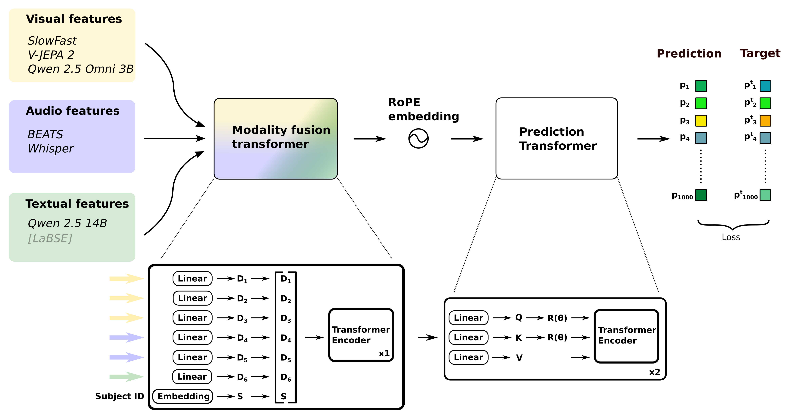
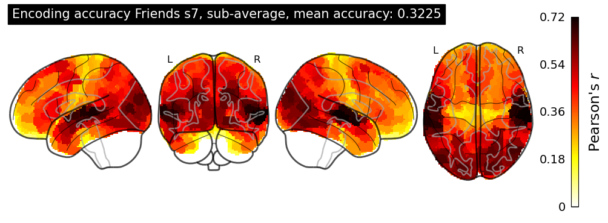
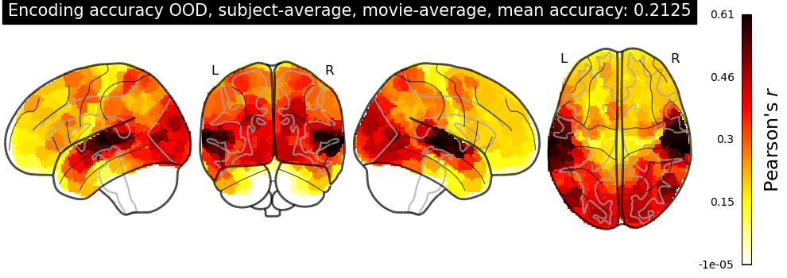

# VIBE: Video‑Input Brain Encoder for fMRI Response Modeling

> End-to-end pipeline for voxel-wise decoding of fMRI time-series from multimodal stimulus features (audio · video · text).
> The codebase was built for the **Algonauts 2025 Challenge** and is being released to foster open research.

## Model architecture


VIBE pairs a modality-fusion Transformer with a prediction Transformer to translate multimodal movie features into voxel-wise fMRI time-series.  Audio (BEATs, Whisper), video (SlowFast, V-JEPA 2, Qwen-Omni) and text (Qwen 2.5 14B, LaBSE) embeddings are first linearly projected to 256 d and enriched with a subject embedding; a single self-attention layer then fuses these per-TR representations across modalities. The resulting feature stack is concatenated and fed to a two-layer Transformer decoder that models temporal dynamics using rotary positional embeddings and no causal mask, letting each time-point attend to both past and future context. A lightweight head maps the decoder output to 1 000 Schaefer parcels, trained under a Pearson-correlation loss with a small MSE term for scale anchoring (λ = 0.03). Twenty independent seeds are ensembled, with specialised sub-models for visual cortex and the default-mode network, yielding mean parcel-wise r = 0.3225 on in-distribution data (Friends S07) and 0.2125 on six out-of-distribution films – a first-place Phase-1 and second place Pase -2 score in the Algonauts 2025 Challenge.




### Preprint

More information on model and can be found [in the preprint](https://arxiv.org/abs/2507.17958).

## Installation

1. Download stimulus materials and fMRI data from the [official Algonauts repository](https://algonautsproject.com/braindata.html).
2. Clone and install the `vibe` package from this repository using your favourite package manager.
3. Set the environment variables to let the package know where the data is stored (see below).

## Directory Layout

```
Algonauts-Decoding/
├── vibe/                     # Python package
│   ├── cli/                  # Entry‑points (train, retrain, fit, submit, merge)
│   ├── data/                 # Dataset, loader, collate
│   ├── models/               # Decoder, ensembling, utilities
│   ├── training/             # Loops, losses, metrics
│   └── utils/                # Logging, plotting, adjacency, misc.
├── features/                 # Audio / video / text feature extraction
├── configs/                  # YAML hyper‑parameters
└── scripts/                  # Slurm & helper bash scripts
```

## Quick Start

1. **Obtain data and features**

   * Download the Algonauts 2024 dataset and extract it to `DATA_DIR`.
   * Extract features using `features.*` scripts.

2. **Environment variables**:

   Set environment variables to link to the data location on your system. Make a copy of the `scripts/env.sh.example` file and change the paths to point to the correct locations. This file is loaded when the scripts in `scripts/` are launched. Make sure the environment variables are set in your current session when running without the scripts.

   Example environmental variables:
   ```bash
   export FEATURES_DIR="/path/to/features"       # Directory where the features are saved/stored
   export DATA_DIR="/path/to/fmri"               # Directory where the fMRI data is stored
   export OUTPUT_DIR="/path/to/outputs"         # Directory where outputs (checkpoints, submission-files, etc.) will be saved
   export WANDB_ENTITY="ncg-algonauts"           # (team) or username that owns the project
   export WANDB_PROJECT="fmri-model"             # project name
   ```

3. Launch full training on SLURM cluster:

   Scripts for running the model on a SLURM cluster can be found in the `scripts/` directory.
  
   To train the full model used in competition, run `scripts/fit_all.sh` to launch training of 4 separate 20 model ensembles. You may need to adjust the corresponding slurm scripts to fit your particular cluster.
   Corresponding fuctions are available for making submission files for all the models (`scripts/submit_all.sh`) and merging model predictions into the final submission (`scripts/merga_all.sh`). **NOTE**: this is very compute intensive and may take a long time to complete.

### CLI

The package exports the following CLI commands that are used to run training and inference.

`vibe-train` – Train the decoder on the standard train/validation split with the hyper‑parameters and feature streams defined in the YAML configs.

`vibe-retrain` – Retrain the best checkpoint on all available data (train + val) for final submission.

`vibe-fit` – Convenience function for running train and retain on same model.

`vibe-submit` – Run inference on the test set and package the predictions into an Algonauts‑compatible ZIP archive.

`vibe-merge` – Merge multiple prediction files (e.g. per‑ROI or per‑fold) into a single submission.

## Configuration

Hyper‑parameters live in two YAMLs:

| File                    | Purpose                          |
| ----------------------- | -------------------------------- |
| `params.yaml`           | Model size, optimizer, scheduler |
| `features.yaml`         | Which feature streams to load    |

In the `configs` directory, you can find the configurations used for our final models.

## Reproducibility & Logging

* All seeds are fixed via `vibe.utils.set_seed()`; provide `--seed` to CLI for deterministic runs.
* Runs log metrics and artefacts to **Weights & Biases**; disable with `WANDB_MODE=disabled` in the environment.
* Train stats, checkpoints, and configs are saved to `<output_dir>/<name>`. Unless overriden in the cli, `$OUTPUT_DIR` will be used.

## Execution time

Training a single model takes around 45 minutes on an A100-40GB GPU. For the full model used in the competition four 20-model ensembles were trained separately and then combined to produce a single submission. For more details on this procedure, please refer to the preprint available below. Estimated compute time for the full model is around 60 GPU-hours, and the disk space required is around 960 GB. Max VRAM use per model is around 20 GB.

##  Preprint

The preprint is available on arXiv:

>  [VIBE: Video-Input Brain Encoder for fMRI Response Modeling](https://arxiv.org/abs/2507.17958)  
> Daniel Carlstrom Schad, Shrey Dixit, Janis Keck, Viktor Studenyak, Aleksandr Shpilevoi, Andrej Bicanski (2025)

---

##  Citation

If you use this codebase or refer to this work in your research, please cite us:

```bibtex
@misc{schad2025vibevideoinputbrainencoder,
  title        = {VIBE: Video-Input Brain Encoder for fMRI Response Modeling}, 
  author       = {Daniel Carlstrom Schad and Shrey Dixit and Janis Keck and Viktor Studenyak and Aleksandr Shpilevoi and Andrej Bicanski},
  year         = {2025},
  eprint       = {2507.17958},
  archivePrefix= {arXiv},
  primaryClass = {cs.LG},
  url          = {https://arxiv.org/abs/2507.17958}
}
```

## License

This project is licensed under the MIT License – see `LICENSE` for details.

> Disclaimer: VIBE only provides wrappers that download or invoke external models for feature extraction. The authors do not redistribute model weights or the Algonauts dataset. When using this repository, you are responsible for ensuring compliance with the individual licenses and any usage restrictions.
